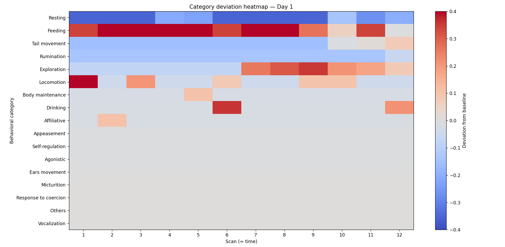
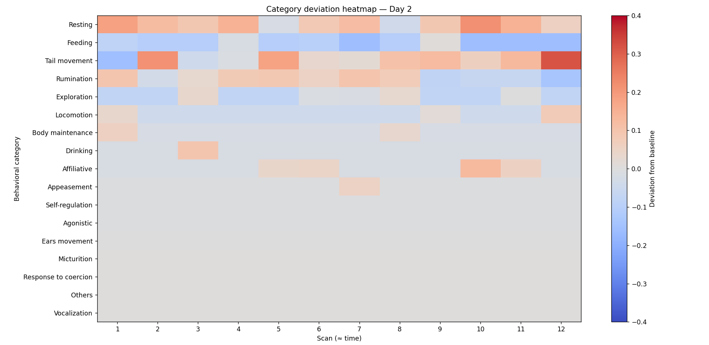
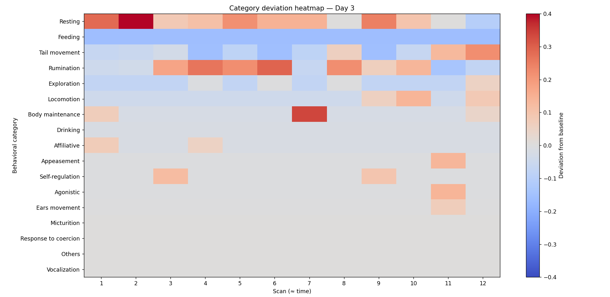
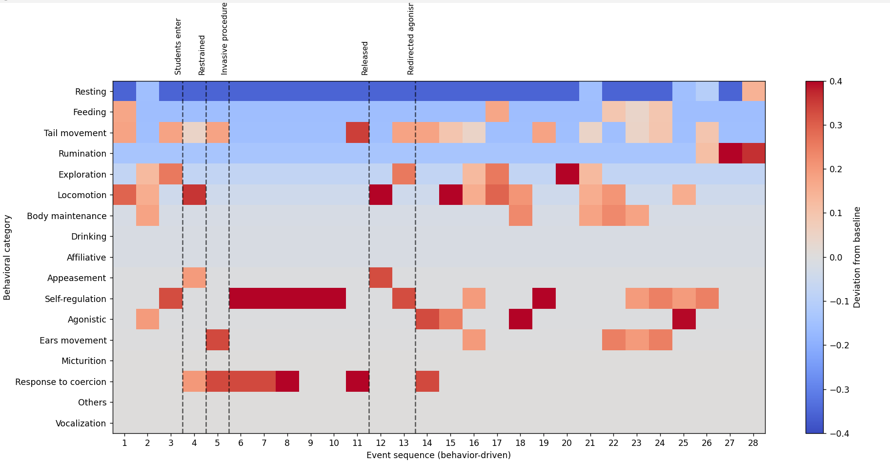
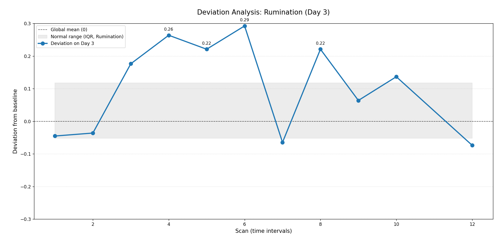
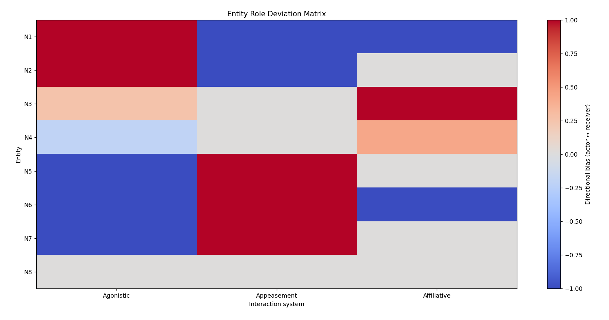
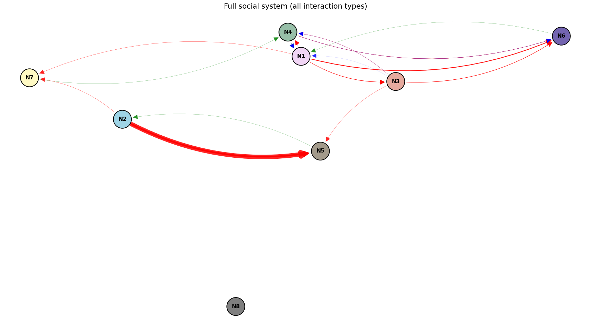

# Discussion  
## Behavioral Systems, Role Asymmetry, and Domain Transfer

---

## Motivation and Background

This project originates from an unresolved analytical discomfort dating back three years.

Shortly after graduating as a Veterinarian, I was assigned the task of observing social groups, cataloging their behaviors, analyzing them, and issuing management recommendations based on my findings.

I was not satisfied with those analyses at the time.

Today, in my transition into Cybersecurity, I decided to apply concepts inspired by this discipline to revisit data that had previously led me to mathematical conclusions I had to question in my original project discussion. Concepts such as behavioral baselines, deviations, outliers, directional flows, role asymmetry, and contextual flags produced results that align far more closely with the observed reality.

Years ago, after spending days within cattle herds, I began noticing that some behaviors, although superficially similar, carried different meanings; that social relationships between individuals were complex; that the group synchronized (or not) its activity depending on context; and that the way interactions flowed through the network was entirely dependent on both context and trust relationships that were continuously negotiated and renegotiated.

Previously, my behavioral analysis relied on absolute counts and bar charts.  
To analyze the interaction network, back then I used three scoring systems derived from the literature available to me at the time to calculate hierarchy indices. These systems relied heavily on agonistic interactions (aggressions, threats, won fights, etc.) to compute dominance and linearly rank individuals, pushing non-conflict participants toward the bottom of the hierarchy by construction.

My conclusion at the time was that these scoring systems flattened social reality by focusing on a single interaction axis.

This raised a central question:

**Can absence of interaction be meaningfully different from social subordination?**

---

## Behavioral Baselines and Deviation as Signal

In cybersecurity, behaviors that deviate from the norm are constantly sought and treated not as inherently malicious or benign, but as signals requiring investigation. However, distinguishing what is abnormal first requires establishing a baseline.

Normal traffic patterns define what is expected; deviations indicate anomalies; and context determines severity.

This approach is closely aligned with **User and Entity Behavior Analytics (UEBA)** in cybersecurity, where behavioral baselines are constructed for users or entities, and deviations are treated as investigation cues rather than verdicts. In UEBA, anomalous behavior does not imply compromise by default; it signals a departure from expected patterns that must be interpreted in context.

Similarly, individuals within a social group can be treated as entities whose behavioral signatures fluctuate over time. Deviations from baseline may reflect stress, environmental change, or adaptive strategies.

In this project, the dataset of scans covering all behaviors expressed by the group during observation days across different contexts was used to construct a general baseline for this specific social group during that time period. This allowed deviations to be examined at both group and individual levels, contextualized and visualized using heatmaps.

---

## Behavioral Deviation Heatmaps — Group-Level Interpretation

### Day 1 — Resource abundance and behavioral stability

**Context:** Fresh hay was provided to the group 10 minutes before the observation window.

- Strong positive deviations in feeding-related behaviors.
- Reduced resting and rumination, reflecting active engagement with a newly available resource.  
- Locomotion shows an early high-intensity peak (Scan 1), followed by sporadic adjustments, indicating repositioning to secure better feeding spots.  
- Social categories (agonistic, appeasement, affiliative) remain largely at baseline levels.

The system operates under low stress and high predictability. Behavioral energy is channeled into resource exploitation rather than social negotiation.

Comparable to a well-provisioned network under normal load: high throughput, low anomaly rates, and minimal corrective activity.

---

### Day 2 — Resource uncertainty and behavioral redistribution

**Context:** No hay is present in feeders, only silage remnants.

- Feeding behaviors are suppressed and temporally fragmented, signaling reduced quantity and quality of available food.  
- Increased rumination emerges, indicating reprocessing of previously ingested food.  
- Affiliative behavior shows localized positive deviations.  
- Appeasement appears briefly elevated.  
- Tail movement in this context reflects idle states.

**Interpretation:**  
The group transitions from exploitation to assessment. Behavioral variance increases, and social behaviors begin compensating for environmental uncertainty.

Resembles a system under partial service degradation: increased probing, lateral communication, and adaptive coordination prior to failure.

---

### Day 3 — Resource absence and system stress

**Context:** Feeders completely empty.

- Suppression of feeding behaviors.  
- Positive deviations in resting and rumination.  
- Expression of locomotion, body maintenance, and autoregulation behaviors.  
- Emergence of agonistic and appeasement signals.  
- Affiliative behavior does not increase proportionally.

The system enters a stress-dominated regime. Behavioral strategies shift toward internal regulation and conflict management.

Functionally similar to sustained resource exhaustion conditions.

Across the three days, heatmaps reveal a progressive redistribution of behavioral energy:

- Environmental exploitation (Day 1)  
- Environmental uncertainty with social modulation (Day 2)  
- Environmental failure with social tension (Day 3)

Stress signatures emerge well before system collapse.

---

## N2 Deviation Heatmap — Focal Observation

This focal observation captures a single individual (N2) exposed to acute, externally imposed stressors.

Key external events include:
- Entry of unfamiliar humans  
- Physical restraint  
- Invasive procedure  
- Release  
- Subsequent social exposure to conspecifics

Event sequencing is behavior-driven rather than time-uniform, prioritizing adaptive responses over fixed sampling intervals.

### Behavioral Phases and Interpretation

**Events 1–3: Pre-stressor**  
Elevated exploration and locomotion with feeding still present. During this phase, unfamiliar individuals (veterinary reproduction students) were performing procedures in a neighboring corral. The system is in anticipatory surveillance.

**Events 4–11: Coercion and invasive intervention**  
- Sharp increases in coercion response and self-regulation.  
- Suppression of feeding and resting.  
- No aggression directed toward humans.

Behavioral energy is redirected toward internal regulation under constrained response pathways.

**Events 12–28: Post-release hypervigilance and delayed effects**  
- Sustained elevation of locomotion and exploration, indicating flight to distant areas and hypervigilance toward humans still present in other corrals.  
- Persistent self-regulation signals.  
- Emergence of delayed agonistic behavior toward conspecifics.

Stress responses outlast the stressor and redistribute across time and targets.

In cybersecurity terms:
- 1–3: Early indicators of compromise  
- 4–11: Forced inspection or intrusive probing with suppressed outward responses  
- 12–28: Post-incident instability with secondary disruptions appearing away from the original stress surface

---

Baseline bands can also be generated per behavioral category, enabling focused analysis of specific behaviors across days. For example, the Day 3 rumination graph shows expression relative to the global mean (0.0) and its internal variability (25–75% IQR).

**Note:** Heatmaps use a visualization limit of 0.40 for global comparison, as exploratory analysis showed most significant behaviors peak near that value (P98). Category-specific plot use limits closer to specific category’s P98.

---

## Scan-Level Anomaly Flags as Investigation Cues

Alongside heatmaps, a lightweight anomaly-flagging layer highlights scans that deviate strongly from typical patterns. Heatmaps provide continuous context; flags surface discrete moments worthy of closer inspection without assigning meaning.

Flags are generated per behavioral category using empirical thresholds. Extreme deviations are marked as outliers and assigned LOW, MEDIUM, or HIGH severity, reflecting rarity within that channel, not importance or harm.

Flagged scans are reviewed through a severity-ordered alert list, supporting human-in-the-loop exploration. This mirrors UEBA-driven monitoring systems, where alerts act as starting points for investigation rather than final conclusions.

---

## Social Analysis

### Limits of Single-Channel Hierarchy Models

Initial analysis measured social structure using dominance scores derived from conflict-based behaviors. This approach has limitations:

- Dependence on social instability.  
- Failure to account for individuals who have successfully negotiated stable access to resources prior to observation.  
- Exclusion of non-conflict negotiation strategies, such as affiliative investment.  
- Inability to visualize system pressure responses, particularly appeasement and buffering strategies.

This dimensional collapse is not unique to ethology. Cybersecurity systems relying on single metrics often confuse silence with stability and noise with risk.

---

## Social Interaction as Directed Systems

Social interactions are analyzed across three axes:
- Agonistic (pressure application)  
- Appeasement (de-escalation)  
- Affiliative (bonding)

Each system is analyzed independently before being layered.

### Role Asymmetry and Directional Bias

Individuals are characterized by:
- Outgoing interactions  
- Incoming interactions  
- Net directional bias  
- Weighted intensity (rarity-adjusted)

| Individual | Agonistic role     | Appeasement role    | Affiliative role   |
|------------|-------------------|---------------------|--------------------|
| N1         | Primary Actor     | Primary Receiver    | Primary Receiver   |
| N2         | Primary Actor     | Primary Receiver    | Isolated           |
| N3         | Secondary Actor   | Isolated            | Primary Actor      |
| N4         | Peripheral        | Peripheral          | Primary Actor      |
| N5         | Primary Receiver  | Primary Actor       | Isolated           |
| N6         | Primary Receiver  | Primary Actor       | Primary Receiver   |
| N7         | Peripheral        | Primary Actor       | Isolated           |
| N8         | Isolated          | Isolated            | Isolated           |

Roles are system-specific; individuals may apply pressure in one system while absorbing it in another.

An entity role deviation matrix was constructed to visualize social behavior expression per individual. 

### Interaction flow graphs

Interaction flow graphs were generated, with edge thickness representing weighted intensity and arrowheads indicating directionality. A layered visualization combines all three systems.

Compared to dominance-score graphs:
- Central individuals are identified beyond conflict winners.  
- Peripheral and isolated individuals become visible.  
- Directionality and disproportionate pressure are explicit.  
- De-escalation strategies are observable.  
- Affiliative investment emerges despite overlaying agonistic pressure.

These nuances are invisible in absolute dominance rankings.

---

## Case Study: N8 — Social Absence as Stability

N8, a medium-sized individual, exhibited no social behaviors in the initial analysis yet maintained stable access to resources. Traditional scoring placed N8 alongside chronically displaced individuals, a conclusion misaligned with reality.

Network analysis revealed:
- N5 receives disproportionate pressure primarily from a single node (N2).  
- N6 absorbs pressure from multiple nodes, directing appeasement selectively.  
- N8 receives no system pressure.

Rather than subordination, this suggests temporary social equilibrium through mutual non-engagement. This interpretation was supported when later, N8 was relocated in another corral and began renegotiating social roles.

N8 resembles an air-gapped system: no exposed external attack surface and no network-level alerts.

---

## Limitations and Future Work

Behavioral data were manually collected and categorized. The analysis focuses on a single group within a limited window, and the group disbanded shortly after. Individual observations relied on behavior-driven sequencing rather than precise timing.

Future work could extend this framework across species and contexts, including mother–offspring interactions, vocal communication, and stereotypical behaviors, enabling cross-system validation.

---

## Closing Reflection

The data did not change.  
The lens did.

By grounding analysis in behavioral baselines and treating deviations as signals rather than conclusions, social structure emerges without reduction to dominance alone. Heatmaps, focal analyses, and anomaly flags preserve context and uncertainty.

That nuance was always present.  
What was missing was a framework capable of seeing it.
